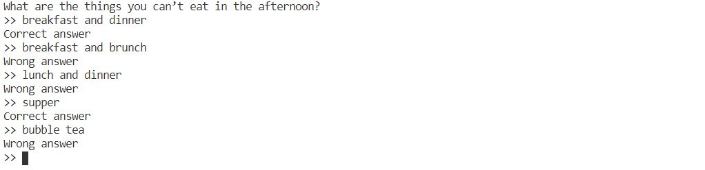

# Practical implementation of Go Interface

Interface is one of the coolest and highly-used features in Go. The concept of interface is not complicated, but it might be hard for new learners to understand how to implement it in practice.<br>
In this sharing, instead of taking random examples like "Animals" or "Books" to explain Go Interface, I am going to share you a practical implementation that I have worked on.

## Problem statement

There are 3 entities: **Question, Keywords and User Input**.

1. A "Question" is just a question, something like "What are the things you can’t eat in the afternoon?", as simple as this.

2. "User Input", is the answer provided by the user for the question, for example "I can't eat breakfast in the afternoon."

3. "Keywords", is the way we evaluate if the user input is correct, for example: if we found "breakfast", correct answer; but if we found "lunch", wrong answer. Doing the keyword-matching is the most tricky part for this application. In this use case, we will have a "boolean" keywords, that comprises of "AND", "OR" and "NOT", and will be used to match the user input. An example of boolean keyword would look like that: ```(breakfast || dinner || supper) && !(lunch || brunch)```

In short, we would need a method to evaluate if the user input matches the "boolean" keywords. To make things clear, check out the example below:

*Who is the boy standing there?*
- User input: He is John
- Keywords: (is && John) || (not && Jane)
- Result: True *(Match “is && John”)*

+ User input: He is not Jane
+ Keywords: (is && John) || (not && Jane)
+ Result: True *(Match “not && Jane”)*

- User input: She is Jane
- Keywords: (is && John) || (not && Jane)
- Result: False *(Does not match any case)*


*What are the things you can’t eat in the afternoon?*

- User input: breakfast
- Keywords: (breakfast || dinner || supper) && !(lunch || brunch)
- Result: True
  
+ User input: lunch
+ Keywords: (breakfast || dinner || supper) && !(lunch || brunch)
+ Result: False

- User input: breakfast and brunch
- Keywords: (breakfast || dinner || supper) && !(lunch || brunch)
- Result: False

With this, I guess you have understood the use case, let's jump into the implementation.

## Implementation
You probably notice that the entities that matter in this application are only "User Input" and "Keywords". Let's start with the User Input.

### User Input
The user input will be a ```string```. However, we will convert it into a new type, ```Sentence```, which is a ```map``` (HashMap). The conversion is simply seperating each word in the input string, and store each word in the HashMap.
With the properties of HashMap, this will make keyword matching much more faster than matching it as a string.
```go
type Sentence map[string]bool

func NewSentence(input string) Sentence {
	return createStringMap(input)
}

func createStringMap(input string) Sentence {
	sentence := Sentence{}
	strSlice := strings.Split(input, " ")
	for _, word := range strSlice {
		sentence[word] = true
	}
	return sentence
}
```

### Keywords
Next, the keywords. Let's look at the example of boolean keywords. It is basically "keyword" that lives between boolean operations. 
```
(breakfast || dinner || supper) && !(lunch || brunch)
```
We will take the statement above, to build a tree strcture with multiple nodes. Each AND, OR, NOT operation, and the "keyword" will each become a node in the tree. So, we will first define our ```Node``` interface, with one method, ```Eval()``` that takes a input of type ```Sentence```, and return a ```bool``` output. 
```go
type Node interface {
	Eval(input Sentence) bool
}
```
In order to implement the ```Node``` interface, all nodes need to have the ```Eval()``` method. Let's start with the implementation of a AND node.
<br>
To define the AND node, we will have a ```ANDNode``` struct, with a ```Nodes``` field of type ```[]Node```. This is the field to store all the children nodes, and we will do ```&&``` operation on all of them in our ```Eval()``` function. Check out the implementation below:
```go
func AND(n ...Node) Node {
	return &ANDNode{n}
}

type ANDNode struct {
	Nodes []Node
}

func (a *ANDNode) Eval(input Sentence) bool {
	result := true
	for i := range a.Nodes {
		result = result && a.Nodes[i].Eval(input)
	}
	return result
}
```
Nothing fancy here, and the important part here is that our ANDNode, now implements the Node interface with its own ```Eval()``` defined. Besides, we have also defined a function, ```AND()``` to initialize the ANDNode. 

Moving forward to OR and NOT is very similar, except that they have different implementation of ```Eval()```. For ```NOTNode```, it will only accept a single children node, instead of a slice. I will not show the code here to make it too long here, you can check it in the ```booleantree``` package.

The last type of node needed, is the "keyword" node that does the actual implementation of keyword matching. We will define a type ```Word``` as a ```string```, and we already have the user input of type ```Sentence```, which is a HashMap. So, to check if the input hits any keyword, we would simply check if the ```Word```, exist in the ```Sentence```.

```go
type Word string

func (w Word) Eval(input Sentence) bool {
	if _, ok := input[string(w)]; ok {
		return true
	}
	return false
}
```
With this, we already have all the nodes to build our tree: AND, OR, NOT and Word. The nodes can further accept children nodes under them as they all implement the Node interface.

## Results

Back to our example: ```(breakfast || dinner || supper) && !(lunch || branch)```<br>
To initialize this boolean keyword, it will look like this: (I use "bt" to represent the ```booleantree``` package here)
```go
keyword := bt.AND(
    bt.OR(bt.Word("breakfast"), bt.Word("dinner"), bt.Word("supper")),
    bt.NOT(
        bt.OR(bt.Word("lunch"), bt.Word("brunch")),
    ),
)
```
We can very easily make changes on the keyword logic, and we could also make it deeply nested with complicated logics with minimal effort. 


Finally, to run the keyword matching, we will just initialize the user input as a ```Sentence``` and run the ```Eval()``` function to get a true/false evaluation.
```go
userInput := "I can't eat breakfast and dinner in the afternoon"
input := bt.NewSentence(userInput)
result := answer.Eval(input) // return true
```


With this, I hope you have a clearer idea about implementing Go Interface, or at least learn something. There are edge cases such as whitespaces, punctuations, letter case etc, but I would not go into it as it is not the main point for this discussion.
<br>

Feel free to contact me if you found any issues, suggestions are welcomed. Thanks!
